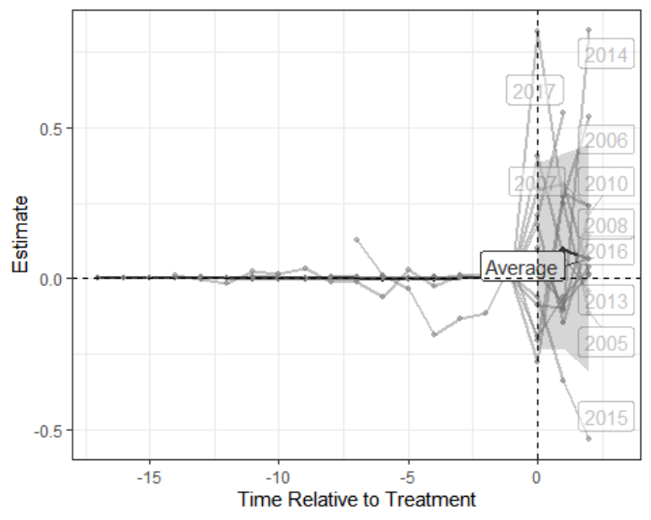

*The original code and thesis could be found [here](https://github.com/Yunlin-Zhou/Impact-of-Amazon-Fulfillment-Centers-on-PM2.5-Levels-in-Surrounding-Areas).*

 

## Abstract

This study investigates the impact of Amazon's fulfillment centers on surrounding areas' fine particulate matter (PM2.5) levels. We used the synthetic controls with staggered adoption method and included the Rural-Urban Commuting Area Codes (RUCC) score as an auxiliary covariate. Our analysis indicates that Amazon's fulfillment centers have a positive effect on PM2.5 levels in surrounding areas, with an average estimated ATT of 0.098. The effect varies across years, with most years showing a positive effect. Furthermore, we found that the effect is concentrated in areas with a lower RUCC score. Our results have implications for policymakers and companies alike, highlighting the importance of considering the environmental impact of industrial activities in surrounding communities.

As the only student in this project, I collected and cleaned the data, wrote the R code, and analyzed the results under the supervision of Professor Rudolph. This research contributes to the literature on the impact of e-commerce and warehousing on air quality and can inform policy decisions related to the siting of fulfillment centers in urban areas.

 

## Figure

The plot below is generated based on the result shows that the effect of the treatment varies across the years, with most of the post-treatment years showing a positive effect. However, it's worth noting that the pre-treatment is balanced, but the post-treatment shows a large scale, suggesting that the effect may be influenced by other factors that were not accounted for in our analysis. Overall, our findings provide evidence that the Amazon fulfillment centers contribute to the increase in PM2.5 levels in surrounding areas.

