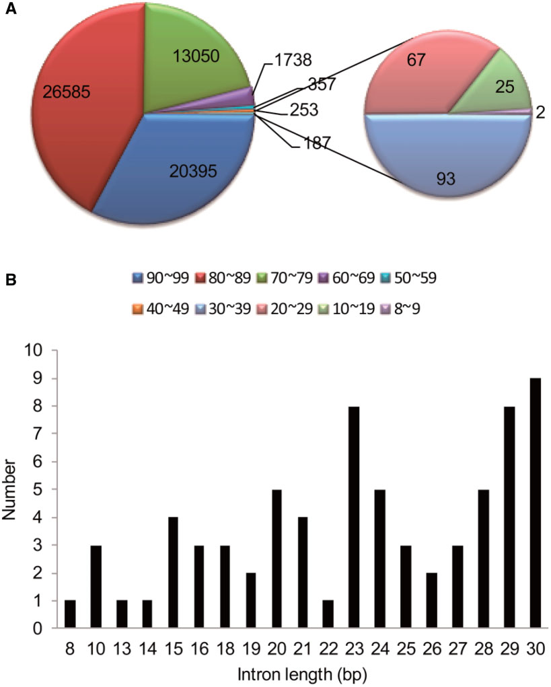
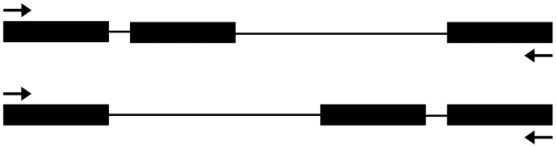
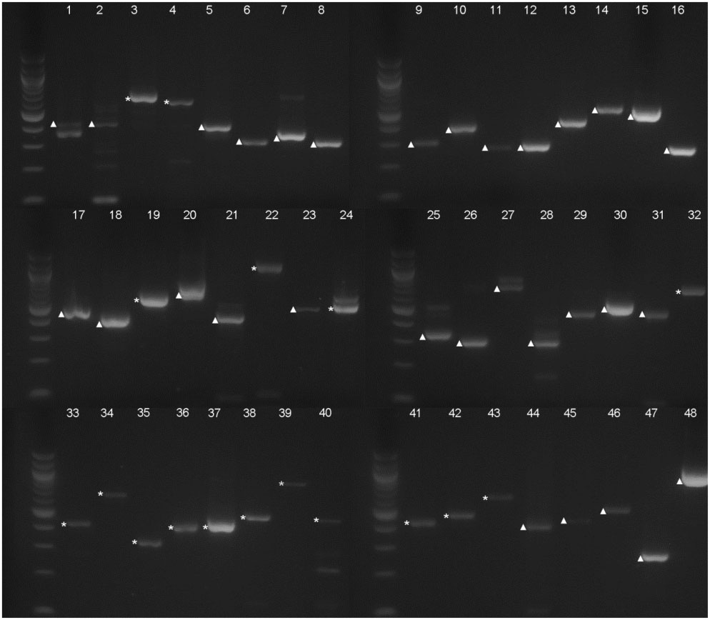
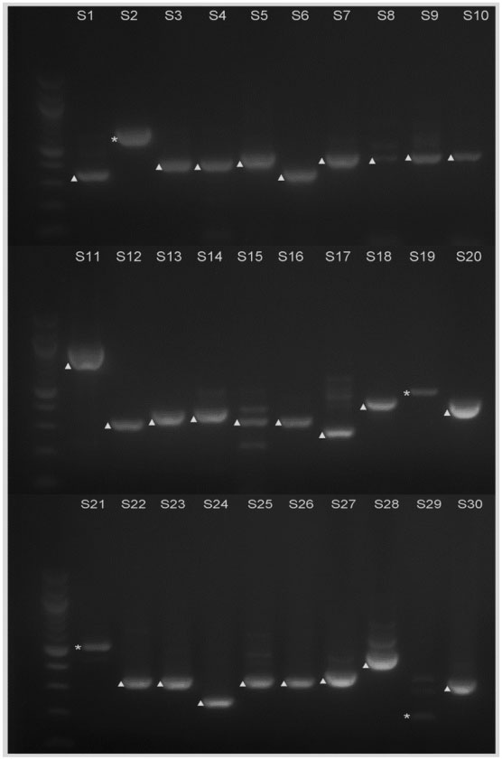
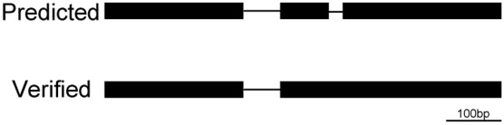

*The original article could be found [here](https://academic.oup.com/gbe/article/10/9/2551/5089237).*

 

## Abstract

Most eukaryotic genes contain introns, which are noncoding sequences that are removed during premRNA processing. Introns are usually preserved across evolutionary time. However, the sizes of introns vary greatly. In Arabidopsis, some introns are longer than 10 kilo base pairs (bp) and others are predicted to be shorter than 10 bp. To identify the shortest intron in the genome, we analyzed the predicted introns in annotated version 10 of the Arabidopsis thaliana genome and found 103 predicted introns that are 30 bp or shorter, which make up only 0.08% of all introns in the genome. However, our own bioinformatics and experimental analyses found no evidence for the existence of these predicted introns. The predicted introns of 30–39 bp, 40–49 bp, and 50–59 bp in length are also rare and constitute only 0.07%, 0.2%, and 0.28% of all introns in the genome, respectively. An analysis of 30 predicted introns 31–59 bp long verified two in this range, both of which were 59 bp long. Thus, this study suggests that there is a limit to how small introns in A. thaliana can be, which is useful for the understanding of the evolution and processing of small introns in plants in general.

 

## Figures

 

### Figure 1

Distribution of the predicted introns shorter than 100 bp. (A) In the Arabidopsis genome, there are 62,565 introns shorter than 100bp. A classification of these introns based on the size is shown. Numbers of introns 50–59bp and 40–49bp in length are 357 and 253, respectively. (B) The length of introns 30 bp or shorter and the number of introns of that length, as predicted by TAIR.

 

### Figure 2

A diagram of the principle for the RT-PCR analysis primers. Besides the putative very small intron, another intron was also included in the RT-PCR analysis to make sure that the PCR product is from a true cDNA fragment. Black boxes represent the exon, and black lines represent the intron. Upper: the very small intron is before another larger intron; lower: the very small intron is after another larger intron. The arrows indicate the positions of the primers for RT-PCR analysis.

 

### Figure 3

Electrophoresis analysis of the RT-PCR products of the selected 48 predicted introns. Each number (1–48) corresponds with one predicted intron from RT-PCR analysis. Bands of cDNA are marked with $\bigtriangleup$; bands of genomic DNA are marked with *. Molecular weight markers are 100 bp DNA ladders (New England Biolabs).

 

### Figure 4

Electrophoresis analysis of the RT-PCR products from the selected 30 predicted introns 31–59 bp in length. S1–S30 correspond to each intron that was analyzed, which are also shown in table 1. Bands of cDNA are marked with $\bigtriangleup$ ; bands of genomic DNA are marked with *. Molecular weight markers are 100 bp DNA ladders (New England Biolabs).

 

### Figure 5

Analysis of the introns in AT1G71280. Upper: the predicted gene model; the very small predicted intron on the right, AT1G71280.1-2, does not exist. Lower: the confirmed gene model; the intron AT1G71280.1-1 is 66bp.

